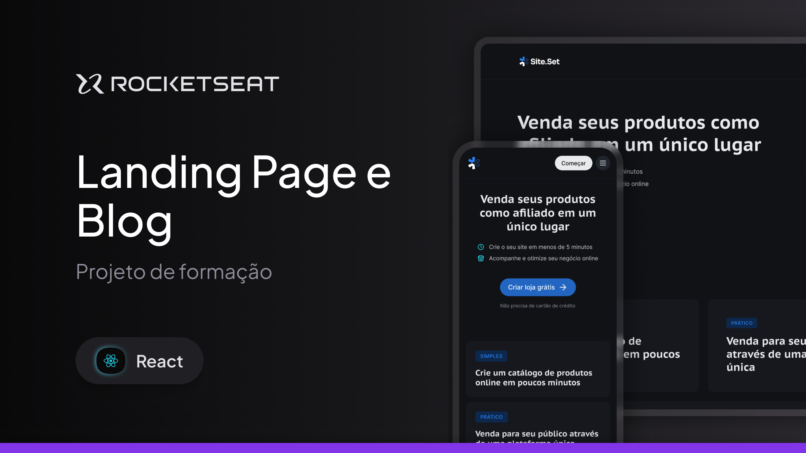

# Dtmoney Transactions

<div align="center"></div>

## 🚀 Purpose

The main goal is to review NextJS concepts and learn new ones.
Review page router concepts, shadcnUI, TailwindCSSS, and more.

## 🛠️ Tech Stack

- React
- NextJS
- TailwindCSS
- ShadcnUI

## 📌 Highlights

- **Production-ready** project using industry standards and patterns
- Designed for **real-world industrial use cases**
- Follows **SOLID principles** and clean code practices
- Demonstrates proficiency in **full-stack development**, from database modeling to UI polish
- Built with **recruiters and real jobs in mind**, showcasing a wide range of skills from system design to performance optimization

## 👤 About Me

I’m a passionate developer with nearly 5 years of experience, working toward becoming a **React specialist** and software architect. I value clean, maintainable code and building systems that solve real problems.

- [Linkedin](https://www.linkedin/in/flvsantos15.com)

<!-- ## 📎 Live Demo / Screenshots

(Include links or images if available)

## 📂 How to Run

```bash
# Clone the repository
git clone https://github.com/yourusername/machinery-dashboard.git

# Navigate into the folder
cd machinery-dashboard

# Install dependencies
npm install

# Run development server
npm run dev
-->
